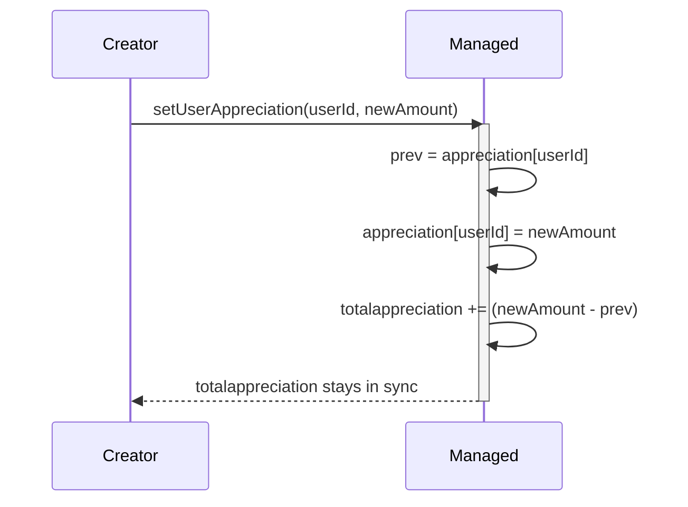
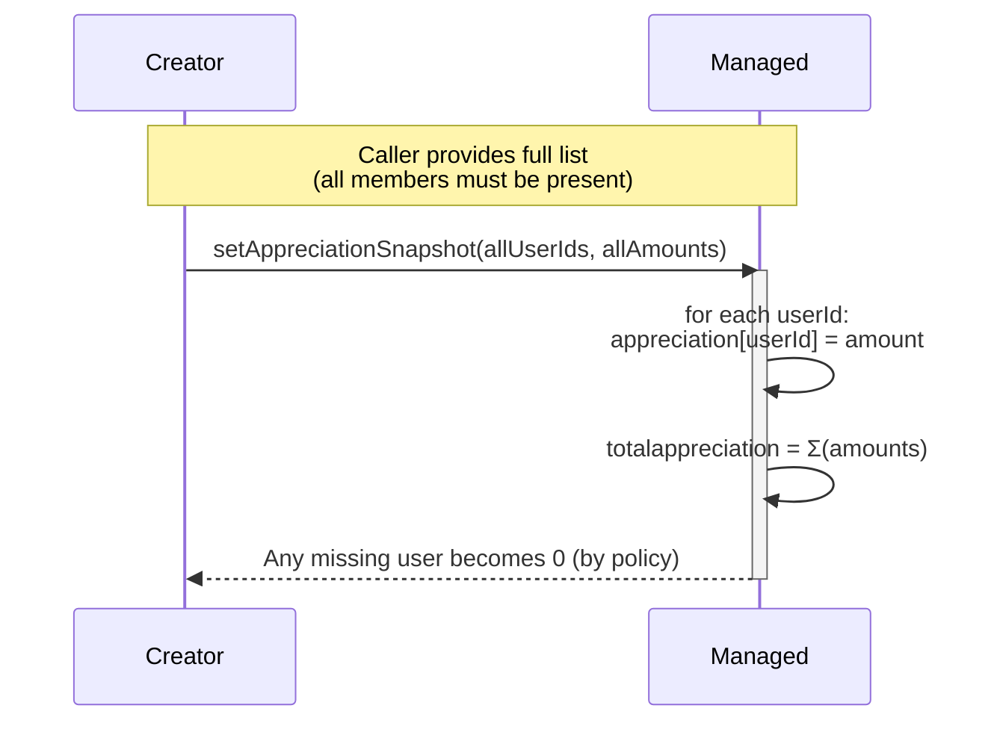
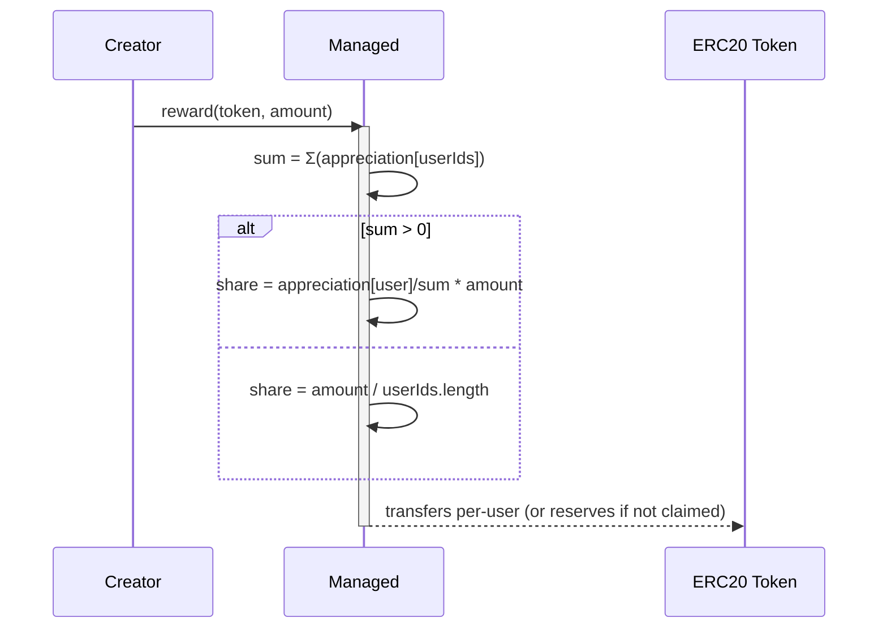

.1) Simple demo: Overwrite on each submit (current choice)

```mermaid
sequenceDiagram
    participant C as Creator
    participant M as Managed (contract)
    participant U1 as User A
    participant U2 as User B
    participant U3 as User C

    Note over C,M: Creator updates a few users<br/>and M recomputes total from storage
    C->>M: setAppreciationOverwrite([A,B],[30,20])
    activate M
    M->>M: appreciation["A"]=30<br/>appreciation["B"]=20
    M->>M: _recomputeTotalAppreciation()<br/>sum(appreciation[all userIds])
    M-->>C: totalappreciation = Σ(appreciation)
    deactivate M

    Note over C,M: Later, distribute tokens
    C->>M: reward(token, amount)
    activate Md
    alt totalappreciation > 0
        M->>M: For each userId:<br/>share = (appreciation[user]/totalappreciation) * amount
    else even split
        M->>M: share = amount / userIds.length
    end

    alt user has claimed
        M-->>U1: transfer share
        M-->>U2: transfer share
        M-->>U3: transfer share
    else user NOT claimed
        M->>M: deposit reserved under userId
    end
    deactivate M
```
2) Incremental “diff” mode (optional future)

3) Full snapshot (strict) mode (optional future)

4) No stored total (recompute on demand) mode (optional future)

5) Claim flow (claimed vs. unclaimed users)
```mermaid
flowchart TD
    A[reward called] --> B{user has claimed?}
    B -- Yes --> C[transfer share to userIdToAddress[user]]
    B -- No --> D[record as reserved: etherBalance / tokenBalance under userId]
    D --> E[Later: claim(userId, beneficiary)]
    E --> F{first claim? bind mapping}
    F -- yes --> G[userIdToAddress[userId]=beneficiary]
    F -- no --> H[verify (optionally) same beneficiary]
    G --> I[transfer all reserved to beneficiary]
    H --> I[transfer all reserved to beneficiary]
    I --> J[hasClaimed[userId]=true]
```

6) Edge cases you can demo

6a. Empty set / zero total → even split
```mermaid
sequenceDiagram
    participant M as Managed
    Note over M: totalappreciation == 0 OR no members
    M->>M: share = amount / userIds.length
    M-->>Note: If userIds.length == 0 → require / revert path
```

6b. Rounding “dust” left on contract
```mermaid
flowchart TD
    S[Start distribution] --> D{integer division leaves remainder?}
    D -- Yes --> R[remainder stays on Managed balance]
    D -- No --> Z[no dust]
    R --> L[visible as token.balanceOf(Managed)]
```